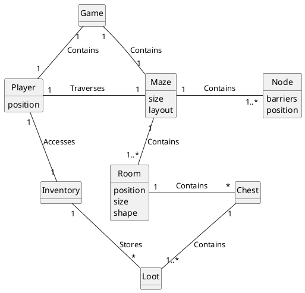
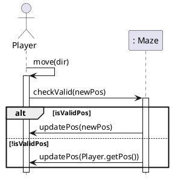
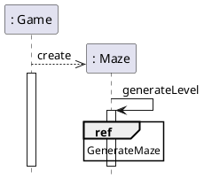
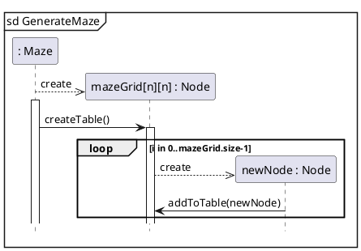

# Domain Model



# Sequence Diagrams

## Player Movement



## Maze Generation




# Class Diagram

```plantuml
@startuml

skinparam classAttributeIconSize 0 

class DisplayMazeConsole {
    {static} public main(String[] args) : void
}
class Player{
    pos : int[] = {int, int}
--
    getPos() : int[]
    updatePos (int dir) : void
}

class Maze{
    +size : int
--
    checkValid(pos) : void
    generateMaze(size) : void
}

class Node{
    barrier : boolean
    index : int {range=[0-n^2]}
--
    getIndex() : int
}

Maze *- "(size^2) \nmazeGrid \n <ordered, Node[][]>" Node : \t\t\t\t
DisplayMazeConsole ->  "(1)\nPlayer\n" Player : \t\t
DisplayMazeConsole -> "(1)Maze\n" Maze : \t\t
@enduml
'''
