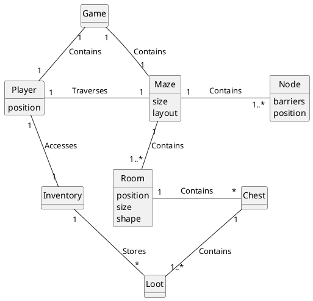
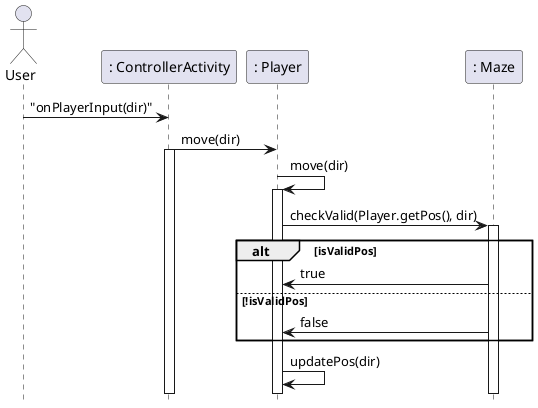
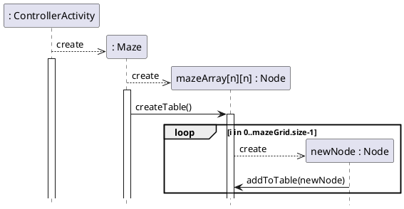

# Domain Model



# Sequence Diagrams

## Player Movement



## Maze Generation



# Class Diagram
```plantuml
@startuml

skinparam classAttributeIconSize 0 

class DisplayMazeConsole {
    {static} public main(String[] args) : void
}
class Player{
    pos : int[] = {int, int}
--
    getPos() : int[]
    updatePos (int dir) : void
}

class Maze{
    +size : int
    mazeArray : Node[][]
    mazeTable : ArrayList<Pair>
    djsTable : DisjointSets
    adjTable : ArrayList<Pair>
--
    checkValid(pos) : boolean
}

class Node{
    rbarrier : boolean
    dbarrier : booleam
    index : int {range=[0, n^2]}
--
    getIndex() : int
}

class Pair{
    int node1;
    int node2;   
}

class DisjointSets{
    ArrayList<ArrayList<Integer>> disjointSets;
--
    addPair(Pair n) : boolean
}
 
Maze *- "(size^2) \mazeArray \n <ordered, Node[][]>" Node : \t\t\t\t
DisplayMazeConsole ->  "(1)\nPlayer\n" Player : \t\t
DisplayMazeConsole -> "(1)Maze\n" Maze : \t\t
DisjointSets --> "(1)djsTable" Maze : \t\t\t
Pair -> "(2*(size*(size - 1)))\nMaze" Maze : \t\t
Pair -> "(size - 1)\ndisjointSets" DisjointSets : \t\t\t
@enduml
'''
