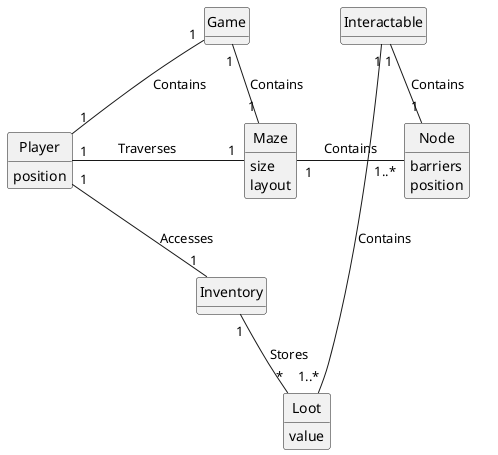
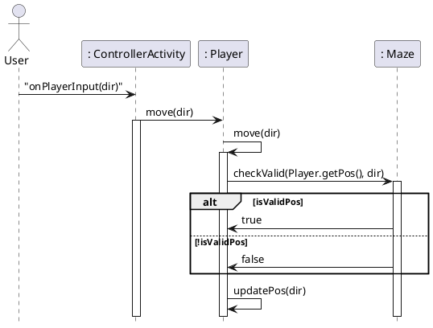
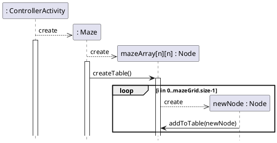

# Domain Model



# Sequence Diagrams

## Player Movement



## Maze Generation



# Class Diagram
```plantuml
@startuml

skinparam classAttributeIconSize 0 

class Player{
    pos : int[] = {int, int}
    chestRef : Chest
    mazeScore : int
    inventory : int[] = {int, int, int...}
    notes : int
--
    getPos() : int[]
    updatePos (int dir) : void
}

class Maze{
    +size : int
    mazeTable : ArrayList<Pair>
    djsTable : DisjointSets
    adjTable : ArrayList<Pair>
    mazeArray : Node[][]
--
    checkValid(int[] pos, char dir) : boolean
    toObscuredString(Player) : String
    isEnd(Player) : boolean
    getSize() : int
}

class Node{
    rbarrier : boolean
    dbarrier : boolean
    id : int {range=[0, n^2]}
    nodeContents : Interactable
}

class Pair{
    node1 : int
    node2 : int   
}

class DisjointSets{
    disjointSets : ArrayList<ArrayList<Integer> {size - 1}
--
    addPair(Pair n) : boolean
}

class MainView{
    activity : FragmentActivity
    binding : MainBinding
--
    getRootView() : View
    displayFragment(Fragment fragment) : void
}

class MazeFragment{
    binding : FragmentMazeBinding
    mazeText : String
    listener : Listener
--
    onCreateView(LayoutInflater inflater, ViewGroup container, Bundle savedInstanceState) : View
    onViewCreated(View view, Bundle savedInstanceState) : void
    updateMaze(String mazeText) : void
    setMazeSuccessConfiguration() : void
}

class MenuFragment{
    binding : FragmentMenuBinding
    listener : Listener
--
    onCreateView(LayoutInflater inflater, ViewGroup container, Bundle savedInstanceState) : View
    onViewCreated(View view, Bundle savedInstanceState) : void
}

interface IMainView {
--
    getRootView() : View
    displayFragment(Fragment fragment) : void
}

interface IMazeView {
    interface Listener
--
    updateMaze(String mazeText) : void
    setMazeSuccessConfiguration() : void
}

interface IMenuView {
    interface Listener
}

class ControllerActivity{
--
    onCreate(Bundle savedInstanceState) : void
    onPlayerMoveInput(char dir, IMazeView mazeView) : void
    onPlayerMoveInput(char dir) : void
    onKeyDown(int keyCode, KeyEvent event) : boolean
    onStartGame() : void
    onEnd() : void
}

class Interactable{
    +id : String
    accessed : boolean
    titleText : String
    bodyText : String
--
}

class Note{
    contents : String
--
}

class Chest{
    itemQuantity : int
    itemType : int
    itemName : String
    loot : String[] = {String, String...}
    value : int[] = {int, int...}
--
}

class Mimic{
--
}

class Nothing{
--
}

class End{
--
}
 
Maze *-left- "(size^2) \nmazeArray \n <ordered, Node[][]>" Node : \t\t\t\t\t
Maze --> "(1)\ndjsTable" DisjointSets : \t\t\t
Maze -> "(size^2-1)\nadjTable\n<ArrayList<Pair>>" Pair : \t\t\t\t\t\t
Maze -> "(size^2-1)\nmazeTable\n<ArrayList<Pair>>" Pair : \t\t\t\t\t\t
IMainView <|.. MainView
IMazeView <|.. MazeFragment
MazeFragment <|.. "IMazeView.Listener" ControllerActivity
IMenuView <|.. MenuFragment
MenuFragment <|.. "IMenuView.Listener" ControllerActivity 
ControllerActivity -left> "(1)\nIMainView" MainView : \t\t
ControllerActivity -> "(1)\nPlayer" Player : \t\t
ControllerActivity -down> "(1)\nMaze\n" Maze :\t\t
Interactable --> "(1) nodeContents" Node
Interactable <|.. Chest
Interactable <|.. Nothing
Interactable <|.. Mimic
Interactable <|.. End
Interactable <|.. Note

@enduml
'''
