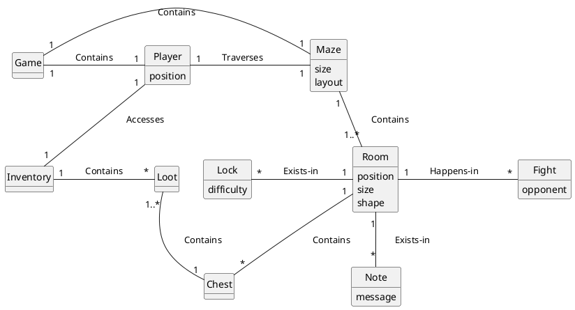

```plantuml
@startuml
hide circle
hide empty methods

'classes
class Player{
    position
}
class Maze{
    size
    layout
}
class Room{
    position
    size
    shape
}
class Inventory{
}
class Loot{
}
class Chest{
}
class Lock{
    difficulty
}
class Note{
    message
}
class Fight{
    opponent
}
class Game{
}

'associations 
Game "1" - "1" Player : \tContains\t\t
Game "1" - "1" Maze : \tContains\t\t
Player "1" - "1" Maze : \tTraverses\t\t
Maze "1" -- "1..*" Room : \tContains\t\t
Player "1" -- "1" Inventory : \tAccesses\t\t
Inventory "1" - "*" Loot : \tContains\t\t
Chest "1" -up- "1..*" Loot : \tContains\t\t
Lock "*" - "1" Room : \tExists-in\t\t
Note "*" -up- "1" Room : \tExists-in\t\t
Fight "*" -left- "1" Room : \tHappens-in\t\t
Room "1" - "*" Chest : \tContains\t\t
@enduml
```
