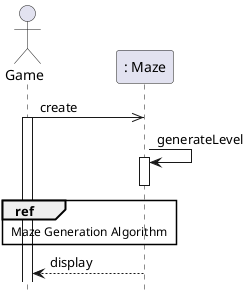

# Maze Generation

```plantuml
@startuml
hide footbox
actor "Game" as game
participant ": Maze" as maze

game ->> maze : create
activate game

maze -> maze : generateLevel
activate maze

ref over game, maze
Maze Generation Algorithm
end ref

deactivate maze

maze --> game : display

@enduml
```