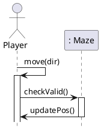

# Player Movement

```plantuml
@startuml
hide footbox
actor "Player" as player
participant ": Maze" as maze

player -> player : move(dir)
activate player

player -> maze: checkValid()
activate maze

/' should we have a ref frame for showing how checkValid either returns
 a new position if move is valid or the player's current position if not?
 Could designate a helper for checkValid, alt frame in the ref'/
maze -> player : updatePos()
deactivate  maze

@enduml
```