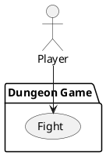

# Load leaderboard

### Scope

Dungeon Game

### Level

User goal

### Primary Actor

Player

### Stakeholders

Player

### Preconditions

Player is [Playing game](play-game.md) and encountered an enemy

### Postconditions

Player returns to their game or has lost and the game is over

### Main Success Scenario

1. Player encounters enemy, presented with a new view of their enemy and combat stats
2. Player presses buttons to attack and defend, while enemy attacks in fixed intervals of time
3. Player defeats enemy, game closes combat screen, there is a small chance of being presented with loot

### Extensions

2a. Player attempts to escape the enemy with Escape button
- Random chance for them to make it away successfully or be stunned for a period of time, open to damage

3a. Player runs out of health and dies to enemy in combat
- Game ends, transition to [Load leaderboard](load-leaderboard.md)

### Frequency of Occurrence

Infrequent - enemies will only spawn infrequently in larger rooms

