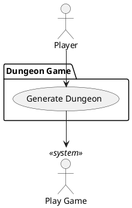

# Generate Dungeon

### Scope

Dungeon Game

### Level

Subfunction

### Primary Actor

The game

### Stakeholders

Player

### Preconditions

Either start or continue button pressed

### Postconditions

Dungeon is fully traversable from start point to level finish and all areas are reachable

### Main Success Scenario

1. Ask player if they want to [Continue to Next Level](use-cases-brief.md).
2. Player presses continue button.
3. Generates a traversable maze with progressively larger rooms and interactables
4. Transitions to showing level with player at start

### Extensions

1a. Player does not choose to [Continue to Next Level](use-cases-brief.md).

### Frequency of Occurence

At the start of game and every subsequent level.

