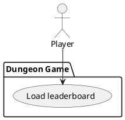

# Load leaderboard

### Scope

Dungeon Game

### Level

User goal

### Primary Actor

Player

### Stakeholders

Player

### Preconditions

Player is finished [Playing game](play-game.md) and either lost or quit their run

### Postconditions

Player's score has been saved and they are back on the main menu

### Main Success Scenario

1. Player is brought to leaderboard screen
2. Results are displayed as the player's number of mazes completed and the total value of their inventory
3. Player enters name, displayed next to the new score entered on the leaderboard
4. Player confirms and results are saved locally to persistent storage, returning player to main menu

### Extensions

3a. Player chooses not to enter a name, instead closes leaderboard dialogue without confirming
- Their results are discarded and not saved without being provided a name

4a. Player's device is connected to the internet
- Player is presented with the option to upload their scores to an online leaderboard
- Player either confirms or denies to upload, but either way their results are saved locally

### Frequency of Occurrence

Constant - occurs after every completed game

