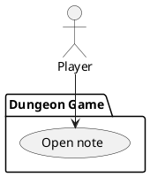

# Open note

### Scope

Dungeon Game

### Level

Subfunction

### Primary Actor

Player

### Stakeholders

Player

### Preconditions

Player is [Playing game](play-game.md) and has encountered a note

### Postconditions

List of possible notes updated to exclude found note and player returned to game

### Main Success Scenario

1. Player encounters note, game displays pop-up with note contents
2. Text is randomly pulled from a collection of possible messages, displayed with confirm button
3. Player taps confirm and the note is closed, content added to log of notes player has already found

### Extensions

N/A

### Frequency of Occurrence

Less frequent: notes generate randomly throughout the maze, attached to the wall

