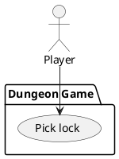

# Pick lock

### Scope

Dungeon Game

### Level

Subfunction

### Primary Actor

Player

### Stakeholders

Player

### Preconditions

Player is [Playing game](play-game.md)

### Postconditions

Player has picked the lock and the interactable is now open for [Looting](loot.md)

### Main Success Scenario

1. Player encounters a lock on an interactable, likely a chest or door
2. Player interacts with locked item and is presented with a small mini-game on top of their view
3. Game window consists of a front-facing visual of a lock with a lockpick, upright in the lock 
4. When player drags a slider or directly pulls on the lockpick, it follows the player's gesture  
  and rotates by fixed angle intervals.
5. Lockpick is turned to the correct angle, there is audio/visual feedback (briefly flashes, audio cue)
6. Player selects "Pick lock" button and attempts to jam the lock open
7. Successful lockpick gives the player a successful dialogue, minigame closes and player  
returns to the default game view.

### Extensions

5a. Player does not set lockpick to correct angle, presses pick lock button
- Lockpick jams and generates negative visual/audio feedback, briefly stops interaction
- dialogue box off to the side   informs player how close they were to the correct angle ("You were close!"/ "Not quite, try the other side")
- Lockpick resets to default angle, resume player interaction
- 
### Frequency of Occurrence

Less frequent: locks generate randomly on chests and doors within rooms. 

