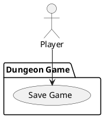

# Save Game

### Scope

Dungeon Game

### Level

User goal, Subfunction

### Primary Actor

The game

### Stakeholders

Player, Game

### Preconditions

[Play Game](play-game.md)

### Postconditions

Game progress is saved

### Main Success Scenario

1. Player completes level, game records progress
2. Player exits app

### Extensions

1a. Instead of quitting, player swaps to other app momentarily

- Game preserves exact position/maze for a limited time
  - Player returns to app within time limit
    - Return player to exact point they left off
  - Player returns to app after time limit expired
    - Return player to last save point
  
### Special Requirements

Android idling app handling

### Frequency of Occurence

At end of each level, as well as whenever app is closed.

