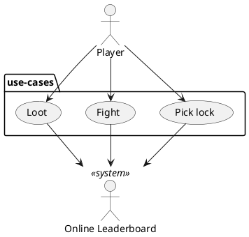

# Use Case Briefs

## Play game
1. Player begins or has completed a level and is presented with two options: continue or exit
2. Player chooses continue, [generate new Dungeon](./generate-dungeon.md)
3. Game is saved to remember last level in persistent storage
4. (alternative) Player chooses exit, go to Leaderboard

## Load Leaderboard
1. Player is brought to leaderboard screen, displaying last run results
2. Player enters name, displayed next to results
3. Results are synchronized with online leaderboard

## Pick Lock
1. Player encounters a lock on an interactable, likely a chest or door
2. Player interacts with locked item and is presented with a small mini-game on top of their view
3. Game window consists of a front-facing visual of a lock with a lockpick, upright in the lock
4. When player drags a slider or directly pulls on the lockpick, it follows the player's gesture  
   and rotates by fixed angle intervals.
5. Lockpick is turned to the correct angle, there is audio/visual feedback (briefly flashes, audio cue)
6. Player selects "Pick lock" button and attempts to jam the lock open
7. Successful lockpick gives the player a successful dialogue, minigame closes and player  
   returns to the default game view.

## Fight
1. Player encounters enemy, game shows combat screen
2. Player presses button to attack, defend, or attempt escape
3. Player defeats enemy, game closes combat screen, chance of gaining reward
4. (casual) Player runs out of health, dies, and goes to Leaderboard

## Open note
1. Player encounters note, game displays pop-up window
2. Text is randomly pulled from a collection of possible contents, and displayed on pop-up

## Loot
1. Player encounters chest, uses interact control to open
2. Game displays chest reward(s)
3. Game adds reward(s) to player inventory

