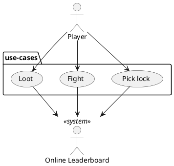

# Use Case Briefs

## Play game
1. After pressing start button, game generates a new maze
2. Player traverses maze with controls
3. Periodically, game is saved temporarily to preserve player progress while switching apps

## Load Leaderboard
1. Player is brought to leaderboard screen
2. Results are displayed as the player's number of mazes completed and the total value of their inventory
3. Player enters name, displayed next to the new score entered on the leaderboard
4. Player confirms and results are saved locally to persistent storage, returning player to main menu

## Pick Lock
1. Player encounters a lock on an interactable, likely a chest or door
2. Player interacts with locked item and is presented with a small mini-game on top of their view
3. Game window consists of a front-facing visual of a lock with a lockpick, upright in the lock
4. When player drags a slider or directly pulls on the lockpick, it follows the player's gesture  
   and rotates by fixed angle intervals.
5. Lockpick is turned to the correct angle, there is audio/visual feedback (briefly flashes, audio cue)
6. Player selects "Pick lock" button and attempts to jam the lock open
7. Successful lockpick gives the player a successful dialogue, minigame closes and player  
   returns to the default game view.

## Fight
1. Player encounters enemy, presented with a new view of their enemy and combat stats
2. Player presses buttons to attack and defend, while enemy attacks in fixed intervals of time
3. Player defeats enemy, game closes combat screen, there is a small chance of being presented with loot

## Open note
1. Player encounters note, game displays pop-up with note contents
2. Text is randomly pulled from a collection of possible messages, displayed with confirm button
3. Player taps confirm and the note is closed, content added to log of notes player has already found

## Loot
1. Player encounters chest and interacts to open chest, or is being rewarded for defeating an enemy
2. Game displays reward as a a dialogue with a particular artifact with icon and value displayed beneath
3. Player confirms the reward and the loot is added to their inventory, total value of player inventory  
now updated

